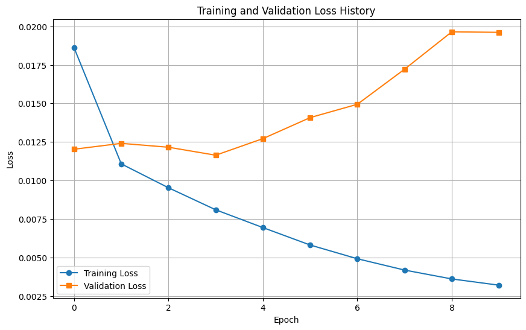
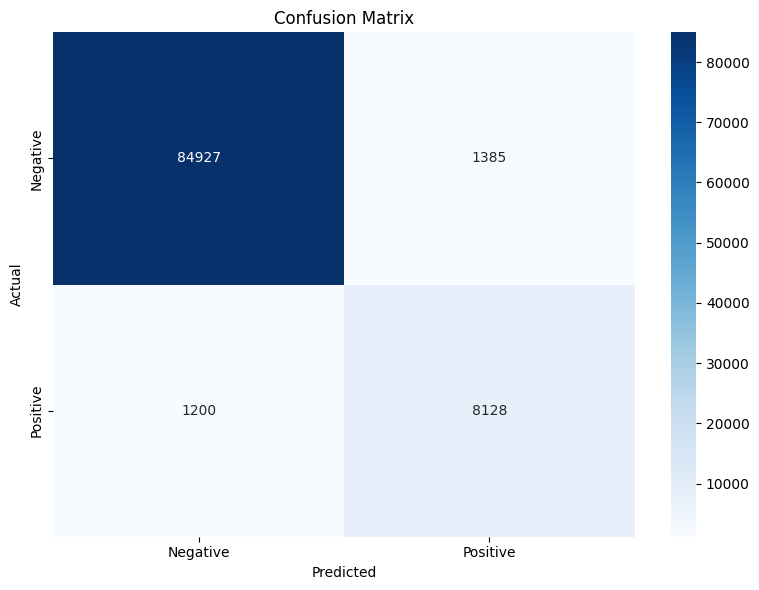
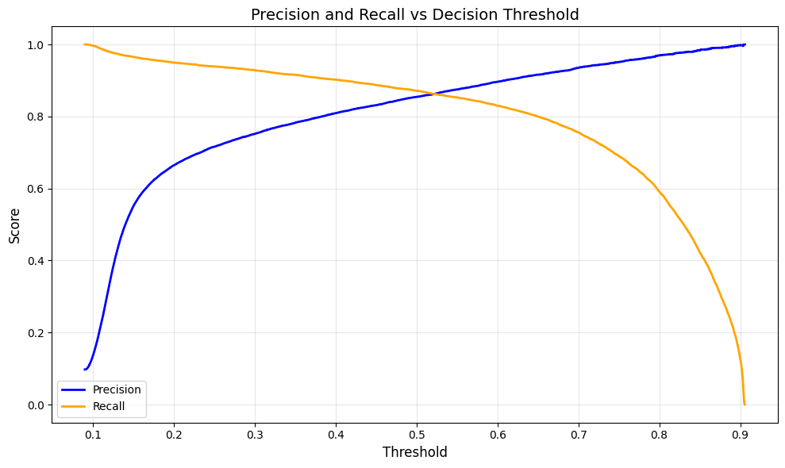
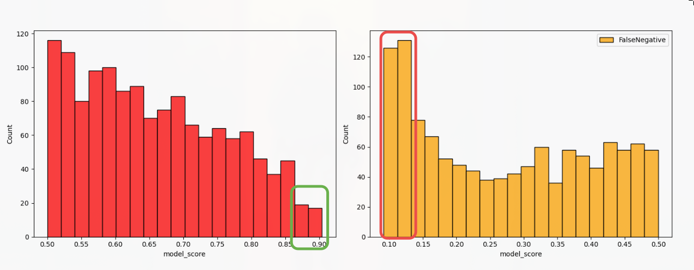
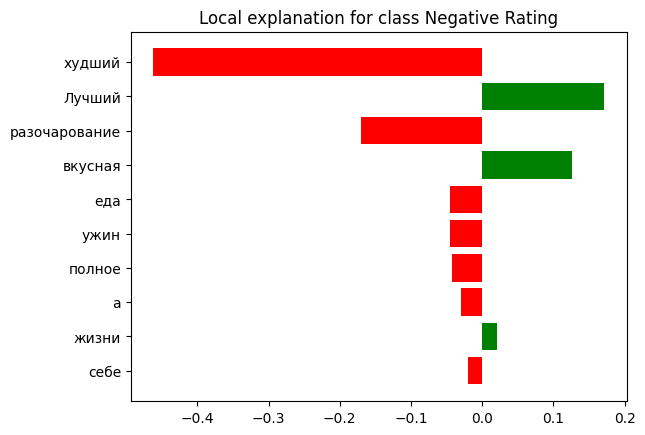
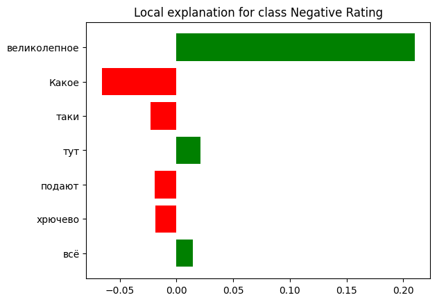

# russian-review-sentiment-classifier

Binary sentiment classification of Russian-language geo reviews, fine-tuned from `intfloat/multilingual-e5-small` and served with NVIDIA Triton Inference Server as an ONNX ensemble.

## Task

Predict whether a review is negative (`label = 1`) or positive (`label = 0`).
Labels are derived from the site rating: `rating <= 2 → 1`, `rating >= 4 → 0`; 3-star reviews are dropped as ambiguous.

The resulting class distribution is **90.2 % / 9.8 %** — the minority (negative) class is the one of practical interest, which drives both the loss function and the metric choice below.

## Data

[Yandex geo-reviews dataset 2023](https://github.com/yandex/geo-reviews-dataset-2023) — 500 000 reviews of organizations in Russia.

| Stage | Rows |
| --- | --- |
| Raw | 500 000 |
| After dropping 3-star reviews and exact-duplicate texts | 478 199 |

Stratified split 70 / 10 / 20:

| Split | Rows | Share |
| --- | --- | --- |
| Train | 334 739 | 70.00 % |
| Validation | 47 820 | 10.00 % |
| Test | 95 640 | 20.00 % |

The dataset is not tracked in git (see `.gitignore`); place `geo-reviews-dataset-2023.csv` under `data/` before running the notebook.

## Model

| Component | Value |
| --- | --- |
| Backbone | `intfloat/multilingual-e5-small` (12 layers, hidden 384) |
| Head | mean pooling over non-PAD tokens → `Linear(384, 1)` |
| Max sequence length | 64 tokens |
| Batch size | 32 |
| Loss | Focal loss, `alpha = [0.5, 1.0]`, `gamma = 2.5` |
| Optimizer | AdamW, `lr = 3e-5`, `weight_decay = 0.01` |
| Schedule | Cosine decay with 5 % linear warmup |
| Precision | Mixed (AMP) + gradient clipping at `norm = 1.0` |
| Epochs | 10, checkpoint selected by best validation F1 |

Training uses a custom PyTorch loop rather than `Trainer`, which keeps the focal-loss weighting, AMP scaling and checkpoint criterion explicit.

Mean pooling is used instead of the `[CLS]` token because E5 is contrastively pre-trained with mean-pooled sentence embeddings — taking `[CLS]` would discard that alignment.



Validation F1 peaks at **0.8649** on epoch 4; afterwards training loss keeps falling while validation loss rises. Selecting the checkpoint by validation F1 rather than by the final epoch is what makes the 10-epoch budget safe.

## Results

Test set (95 640 reviews), decision threshold 0.5:

| | precision | recall | f1-score | support |
| --- | --- | --- | --- | --- |
| 0 (positive) | 0.9861 | 0.9840 | 0.9850 | 86 312 |
| 1 (negative) | 0.8544 | 0.8714 | 0.8628 | 9 328 |
| accuracy | | | 0.9730 | 95 640 |
| macro avg | 0.9202 | 0.9277 | 0.9239 | 95 640 |
| weighted avg | 0.9732 | 0.9730 | 0.9731 | 95 640 |

<p align="center">
  
  
</p>

### Why macro-F1 and not accuracy

At a 90.2 / 9.8 split, the constant predictor "everything is positive" scores **0.902 accuracy** while being useless. Accuracy is a support-weighted average, so the majority class contributes ~90 % of it and the metric is nearly blind to the class the system exists to find.

Macro-F1 averages per-class F1 with equal weight:

```
F1_macro = (F1_0 + F1_1) / 2
```

The same constant predictor scores `F1_macro = (0.949 + 0) / 2 = 0.474`, so the metric separates a real model from a degenerate one. It also keeps precision and recall balanced on the minority class, which a metric like recall@class-1 alone would not.

**Applicability limits.** Macro-F1 assumes both classes matter equally and that the 0.5 threshold is the operating point. If the cost of a missed negative review differs from the cost of a false alarm, macro-F1 is the wrong objective — use the precision-recall curve above to pick a threshold under an explicit cost ratio, or report PR-AUC, which is threshold-free and, unlike ROC-AUC, does not flatter the model under class imbalance.

### Error analysis



Most errors sit close to the threshold — mixed reviews ("great gym, but queues at 6 pm" with a 5-star rating). The tails, where the model is confident and wrong, are mainly label noise: the rating on the site contradicts the text.

LIME on individual predictions confirms the model keys on sentiment-bearing lexemes rather than surface artifacts:

<p align="center">
  
  
</p>

## Serving architecture

Triton hosts three models; clients call only the ensemble.

```
             ┌──────────────────────── text_classifier_ensemble ──────────────────────┐
             │                                                                      │
TEXT ───────►│  text_tokenizer            ──────►        bert_classifier             │──────► OUTPUT
(BYTES,      │  backend: python                          backend: onnxruntime       │       (FP32, [1])
 [-1])       │  multilingual-e5-small                    model.onnx (+ .onnx.data)  │       raw logit
             │  truncation + pad to 64                   dynamic batching           │
             │                                                                      │
             │      └─► input_ids      (INT64, [64]) ─────────┘                      │
             │      └─► attention_mask (INT64, [64]) ─────────┘                      │
             └──────────────────────────────────────────────────────────────────────────┘
```

- `max_batch_size = 32`, dynamic batching enabled on both steps.
- Tokenization runs server-side, so clients send raw UTF-8 strings and need no `transformers` dependency.
- `OUTPUT` is a **raw logit**, not a probability — apply `sigmoid` client-side (see `test_triton.ipynb`).
- The tokenizer is vendored under `triton/models/text_tokenizer/1/tokenizer/`, so the container needs no network access at startup.
- `model.onnx.data` is stored via Git LFS.

## Running

1. Run `train_notebook.ipynb` end to end. It trains the model, writes `best_model_state.pth`, and exports `triton/models/bert_classifier/1/model.onnx` (plus `model.onnx.data`).

2. Start the server:

   ```bash
   docker-compose up -d --build
   ```

   `-d` detaches the container; `--build` rebuilds the image from `Dockerfile` (Triton 24.10 + `transformers`, `numpy`). Requires an NVIDIA GPU and the NVIDIA Container Toolkit — `docker-compose.yaml` reserves one device.

   Exposed ports: `8000` HTTP, `8001` gRPC, `8002` Prometheus metrics.

3. Check that the models loaded:

   ```bash
   curl -s localhost:8000/v2/models/text_classifier_ensemble/ready -o /dev/null -w '%{http_code}\n'
   ```

4. Send requests: run `test_triton.ipynb`, which calls the ensemble over gRPC and compares the result against direct `onnxruntime` inference.

## Layout

```
data/                            geo-reviews dataset (gitignored)
images/                          figures used in this README
triton/models/
  text_classifier_ensemble/      ensemble scheduling config
  text_tokenizer/1/model.py      Python backend, HF tokenizer
  bert_classifier/1/model.onnx   exported classifier
train_notebook.ipynb             data prep, training, evaluation, ONNX export
test_triton.ipynb                gRPC client and ONNX parity check
docker-compose.yaml / Dockerfile Triton 24.10 image and GPU runtime
```
